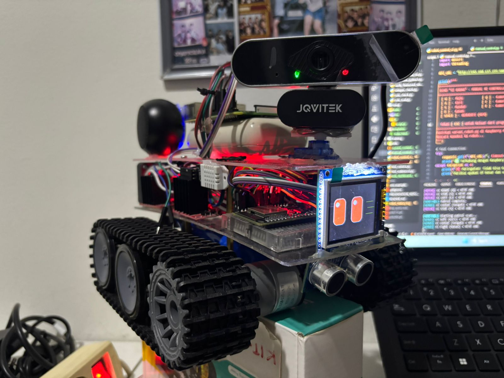
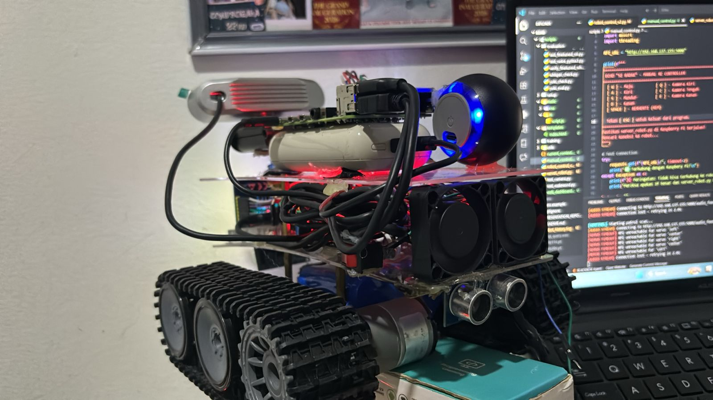
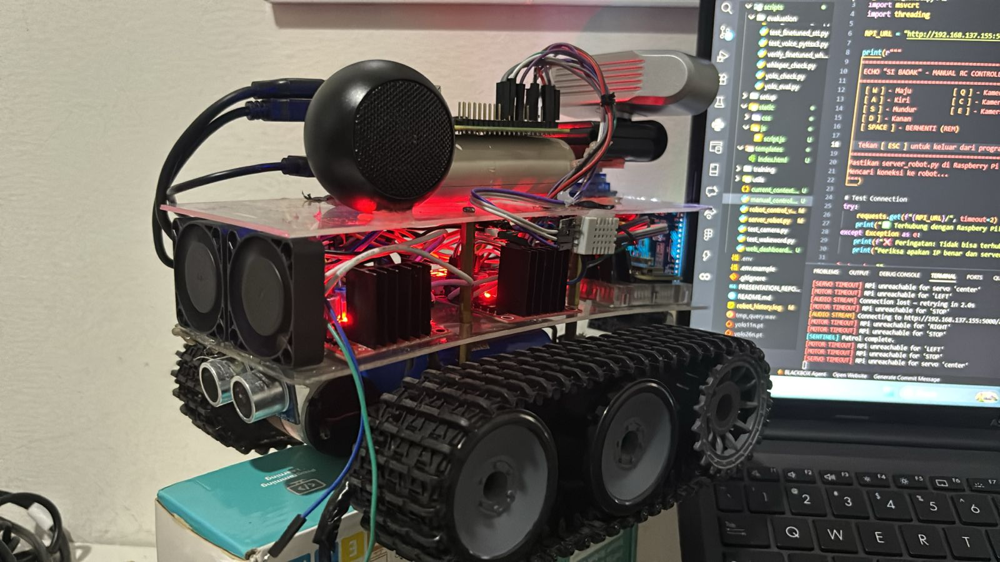
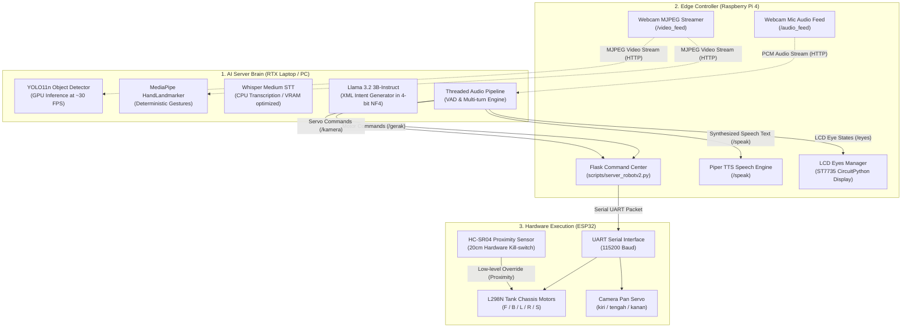
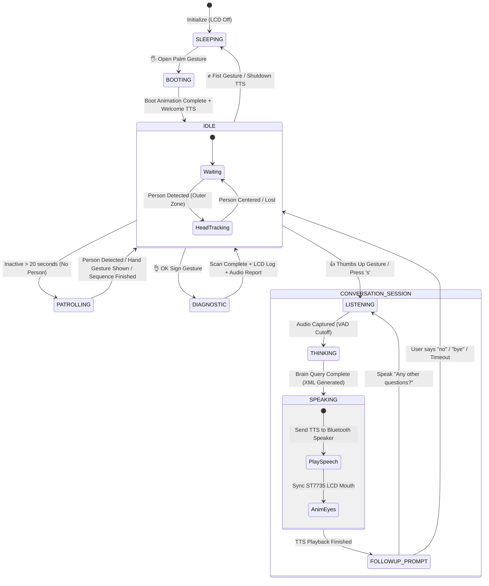
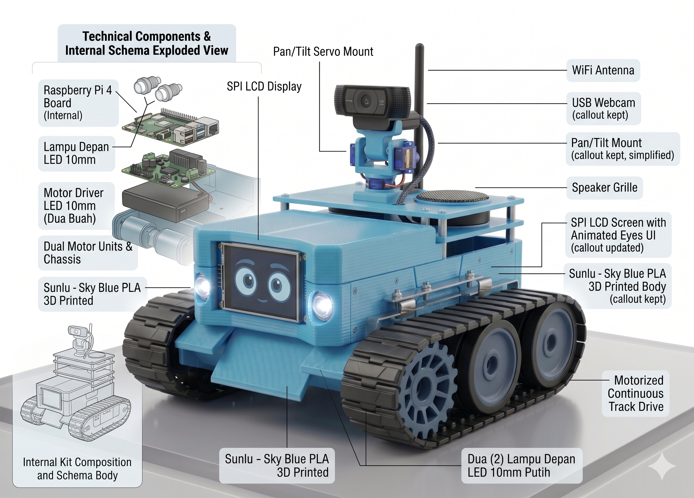

# Echo: Environmental Cognition and Human Observer (v6.0)

**Echo** is a state-of-the-art, context-aware interactive robot assistant built on a **local hybrid edge-server architecture**. By combining high-performance deep learning inference on a consumer-grade GPU with robust edge controllers, Echo delivers zero-latency multimodal interaction (Vision, Speech, and Gestures) without relying on cloud services.

This repository contains the full v6.0 software stack, including the central multi-threaded AI brain, the edge web services, safety gate validation pipelines, LCD eye state animations, and the web-based diagnostic dashboard.

---

## 🎥 Physical Robot & Video Demo

### 📸 Hardware Showcase
Here is the physical tank-chassis design of Echo showing the camera panning head servo, logic power separation bank, motor drive battery pack, and the embedded ST7735 LCD eyes from different views:

| Tampak Depan (Front View) | Tampak Belakang Kiri (Rear Left) | Tampak Belakang Kanan (Rear Right) |
| :---: | :---: | :---: |
|  |  |  |

### 🎬 Real-World Video Demonstration
Watch Echo wake up from **Sleep Mode** via Open Palm detection, process speech transcripts and visual context locally on a GeForce RTX GPU, run the **9-layer safety gate mechanism** to safely filter movement overrides, perform dynamic **autonomous sentinel patrols**, and track human faces:

<video src="https://github.com/HuangMingZhi0206/ECHO--Environmental-Cognition-and-Human-Observer-/raw/main/simple_demo_video.mp4" width="100%" controls></video>

*(Or you can view/download the compressed demo file directly: [simple_demo_video.mp4](simple_demo_video.mp4))*

---

## 📸 System Blueprint & Architecture

Echo utilizes a distributed three-tier processing model to handle intense vision models, natural language processing, and real-time serial motor control:



---

## 🚀 Key Premium Features (v6.0)

### 1. Multi-Threaded Non-Blocking Pipeline
To eliminate conversational lag and processing locks, Echo isolates heavy tasks into concurrent daemon threads:
*   **Main Thread**: Handles frame capturing, YOLO object tracking, MediaPipe hand landmark processing, and the real-time Pygame HUD.
*   **Remote Audio Streamer**: Continuously buffers raw PCM audio (16-bit, 16kHz, mono) from the Raspberry Pi's USB microphone.
*   **Audio Pipeline Worker**: Manages Whisper Speech-to-Text, local Llama 3.2 3B-Instruct reasoning, and safety gate evaluation.
*   **Sentinel Patrol Worker**: Manages background scanning behaviors during inactive periods.

### 2. Deterministic Gesture Control (MediaPipe)
While conversational reasoning runs on the probabilistic LLM, safety and operational state commands are evaluated **deterministically** via MediaPipe, completely bypassing the LLM for sub-millisecond dispatch:
*   🖐️ **Open Palm**: Wakes Echo up from **Sleep Mode** (plays a custom loading sequence on the LCD screen, opens normal eyes, and announces online readiness).
*   ✊ **Fist**: Puts Echo into **Sleep Mode** (parks the camera servo at the center, turns off the LCD backlight, stops background patrolling, and goes to sleep).
*   👍 **Thumbs Up**: Initiates a multi-turn conversation session by greeting the user and starting VAD recording.
*   👌 **OK Sign**: Triggers an automated system diagnostic scan (tests serial connection, pings motor driver, sweeps camera servo, reads DHT22 temperature/humidity, logs VRAM metrics, writes the log to the LCD screen, and speaks the diagnostic results).
*   **Direct Control Actions**: User hand signs immediately trigger directional movements: Pointing Index (**FORWARD**), Fist (**BACKWARD**), Thumb Left (**LEFT**), Thumb Right (**RIGHT**), Open Palm (**STOP**).

### 3. Autonomous Sentinel Patrol
If Echo is awake and left in an `IDLE` state for over 20 seconds with no human in sight, the background **Sentinel Patrol** thread activates:
1.  **Head Sweep**: Pans the camera servo left, center, right, and center (2s each) to scan the surroundings.
2.  **Body Turn**: Sends motor signals to rotate the tank tracks left ~30°, stops for 2s, rotates right ~60° to sweep the opposite sector, and then rotates left ~30° to return to the original alignment.
3.  **Active Interruption**: If the camera detects a person (`person` class via YOLO) or if a gesture is registered at any frame during the patrol, the patrol sequence **abruptly halts**, resetting the robot immediately to `IDLE` to focus on the human.

### 4. Wide-Zone Servo Camera Tracking
When Echo is `IDLE`, it automatically tracks the user's face/body using its pan servo. 
*   To prevent continuous, jittery camera movements, Echo implements a **wide dead-zone** filter (between 20% and 80% of the horizontal resolution).
*   The camera head only shifts (left or right) when the tracked human steps into the outer boundaries, keeping the user in the frame without distracting head wobbles.

### 5. Multi-Turn Conversation Flow
Once a conversation is started (via the Thumbs Up gesture), Echo enters an active dialog session. 
*   After speaking its answer, it asks, *"Do you have any other questions?"* and opens a VAD (Voice Activity Detection) microphone.
*   If the user answers with a negative phrase (*"no"*, *"nope"*, *"bye"*, *"nothing"*), Echo politely closes the session (*"Goodbye! Have a nice day!"*) and goes back to patrolling.
*   Any other spoken response is treated as a continuous question, maintaining a smooth conversation without requiring the wake gesture again.

### 6. Robust 9-Layer Safety Gate
To prevent dangerous physical behavior resulting from LLM hallucinations, Echo passes all intents through a robust safety gate:
1.  **Phrase-Based Pre-check**: Flags inputs that lack physical motion verbs (*"move"*, *"go"*, *"stop"*).
2.  **Prompt Engineering**: Restricts the Llama-3.2 model output using structured XML tags (`<response>` and `<command>`).
3.  **ChatML Enforcement**: Uses system tokens to prevent template leakage.
4.  **Robust Regex XML Parser**: Cleanses raw outputs and handles incomplete tags.
5.  **Post-Parse Safety Override (Core Gate)**: Blocks any physical command if Layer 1 confirmed the user did not say a movement verb.
6.  **Direct Keyword Match**: Overrides the LLM's chosen command if the user explicitly specified a direction that the LLM misclassified.
7.  **Template Leakage Filter**: Scrubs conversational preambles.
8.  **Ultrasonic Kill-Switch**: The local ESP32 motor driver immediately cuts PWM drive if the ultrasonic sensor measures an obstacle closer than 20cm, ignoring all Wi-Fi commands.
9.  **Gesture Preemption**: An "Open Palm" or "Fist" gesture immediately cuts off and halts any ongoing motor command.

---

## 🤖 Multimodal State Machine & Control Flow

The diagram below details the operational state machine of the central AI engine, tracking transitions from sleep to active voice and sentinel scanning:



---

## 📂 Project Structure

```text
Echo/
│
├── scripts/
│   ├── robot_control_v2.py      # Main Orchestrator (Vision, STT, LLM, Gestures, Sentinel, Tracking)
│   ├── server_robotv2.py        # Raspberry Pi v6.0 Command Center (Flask, LCD Eyes, Piper TTS, Serial)
│   ├── web_dashboard.py         # Flask Web Dashboard Server (Console logs, YOLO metrics, Diagnostic stats)
│   ├── manual_control.py        # Debug utility for direct motor control pings
│   ├── test_camera.py           # Verification script for local/remote MJPEG feeds
│   ├── test_wakeword.py         # Debug listener for openwakeword verification
│   ├── static/                  # Static styles, CSS, and JS for Web Dashboard UI
│   └── templates/
│       └── index.html           # Live control dashboard frontend template
│
├── robot-assistant/
│   └── models/
│       ├── yolo11n.pt           # Fine-tuned YOLO11 weights (mAP50: 76.4%)
│       ├── hand_landmarker.task # MediaPipe Gesture Landmark model
│       └── whisper-finetuned/   # Local Whisper STT fine-tuned checkpoint
│
├── Echo_Journal_IJECE_Final.docx # Academic Journal Paper (Formatted, 2-Columns, Purged Authors)
├── echo_text.txt                # Raw academic paper source text
├── robot_history.log            # Running operational log (Log Rotation: 5MB, 3 backups)
├── generate_journal.py          # Python utility to rebuild document from echo_text.txt
└── .env                         # Local configuration variables
```

---

## ⚡ Setup & Launch Instructions

### 1. Server Configuration (Laptop / PC)
Ensure you are running on an RTX series GPU with **CUDA 12.0+** and Python **3.10+**.

```powershell
# 1. Clone the repository and enter the directory
cd "Echo"

# 2. Activate virtual environment
.\robot-env\Scripts\activate

# 3. Configure local environment variables (.env)
# Create a .env file with the following variables:
# RPI_BASE_URL=http://<YOUR_RASPBERRY_PI_IP>:5000
# LLM_BASE_MODEL=unsloth/Llama-3.2-3B-Instruct-bnb-4bit
# VISION_MODEL_PATH=robot-assistant/models/yolo11n.pt
```

### 2. Edge Launch (Raspberry Pi 4)
Log into your Raspberry Pi and start the hardware server. This binds the webcam stream, microphone feed, serial communications with the ESP32, and the ST7735 LCD eyes display panel:

```bash
cd ~/robot-assistant
python scripts/server_robotv2.py
```

### 3. Brain Launch (Server Laptop)
Run the central orchestration engine:

```powershell
.\robot-env\Scripts\python.exe scripts/robot_control_v2.py
```

### 4. Web Dashboard (Optional)
To view real-time log outputs, YOLO performance matrixes, and live operational stats, launch the web dashboard:

```powershell
.\robot-env\Scripts\python.exe scripts/web_dashboard.py
```
Open your browser and navigate to **`http://localhost:8080`**.

---

## 🚀 Future Development Roadmap & Blueprint

The following technical schema outlines the exploded view of Echo's hardware configuration for future iterations and development scale-ups. This blueprint details the placement of core technical components including the internal Raspberry Pi 4 board, SPI LCD Display, dual motorized tank units, USB Webcam on a Pan/Tilt Servo mount, WiFi Antenna, and dual 10mm LED arrays, all housed within the custom Sky Blue PLA 3D printed chassis:



---

## 🏆 Development Team & Course Credit

This project was initially developed as the Final Project for the Intelligent Robotics System course within the Department of Informatics, Faculty of Computer Science at President University, Indonesia.

**🚀 Current Project Status: KIYO 2026**
The project is currently undergoing advanced development and optimization. We are proud to announce that this system has successfully passed the national selection phase and has been chosen to represent Indonesia at the **Korea-International Youth Olympiad (KIYO) 2026**.

**Team Members:**
* **Principal Developer:** Kevin Syonin (MingZhi Industry / Product Development Engineering)
* **Academic Institution:** President University, Faculty of Computer Science
